Mocking APIs for Emulation Driven Development

(A one sentence suggestion padded out into a lightning talk)

[Lee Johnson](http://leejo.github.io)

YAPC::{NA,EU} 2016

---

### [Mojolicious::Plugin::OAuth2::Server](https://metacpan.org/release/Mojolicious-Plugin-OAuth2-Server)

Note:
- spoke about this at YAPC::EU last year
- suggested i might split out the core logic

---

### [Net::OAuth2::AuthorizationServer](https://metacpan.org/release/Net-OAuth2-AuthorizationServer)

Note:
- did
- why? because needed to add password grant
- why?

---

### [Business::Mondo](https://metacpan.org/release/Business-Mondo)

<p class="fragment"> [Business::GoCardless](https://metacpan.org/release/Business-GoCardless) </p>

<p class="fragment"> [Business::Fixflo](https://metacpan.org/release/Business-Fixflo) </p>

Note:
- which uses *two* auth code grants
- the one MPOS supported, and password grant that it didn't
- and i need to emulate that
- learned from other modules i've written

---

## Why Emulation?

### REST

---

# REST?

### REpresentational State Transfer

---

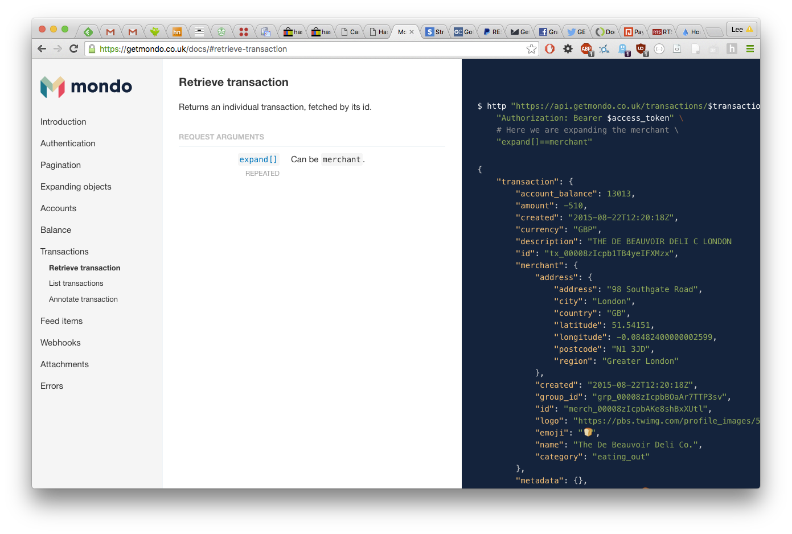

---

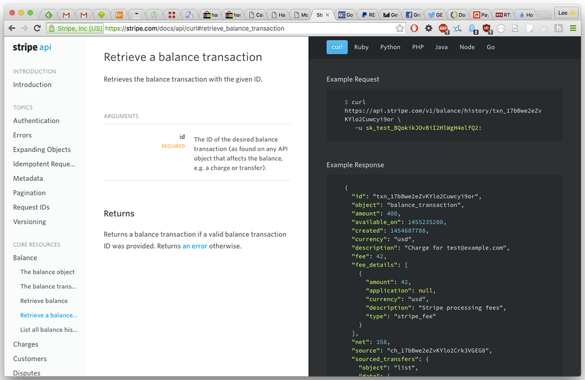

---


---


---

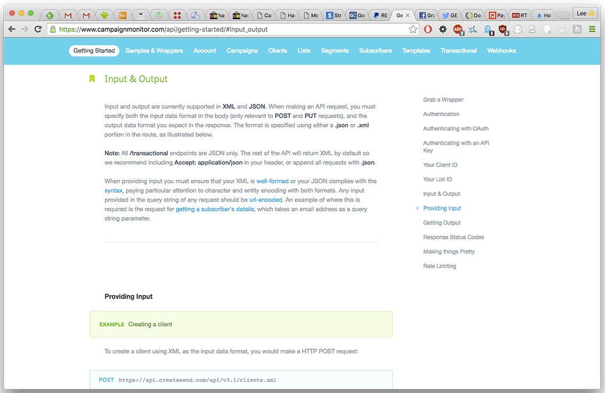

---

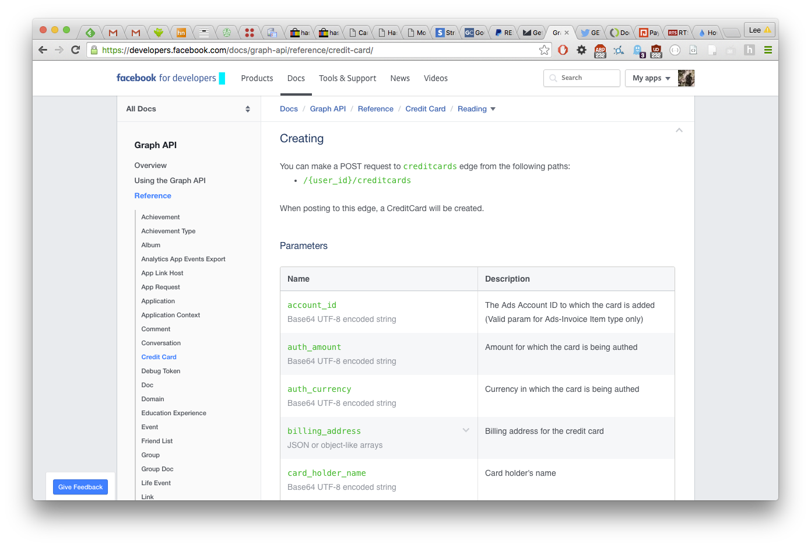

---

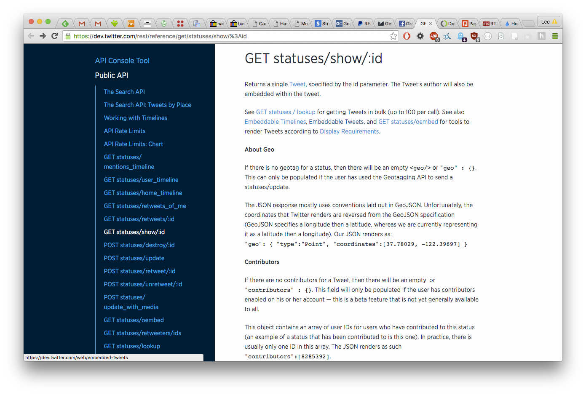

---

Content-Type vs .json/.xml.

Send application/x-www-form-urlencoded vs json.

Plurals or singular.

Pagination, HATEOAS.

Bearer tokens / JWT / OAuth1/2.

Expanded data vs References.

Errors in the headers vs body vs HTTP status codes.

Note:
- all these differences
- and more...

---

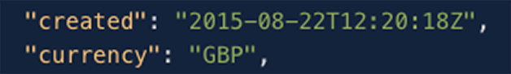

Note:
- mondo
- sensible?

---

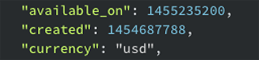

Note:
- stripe
- epoch times?
- lower case currency codes?

---

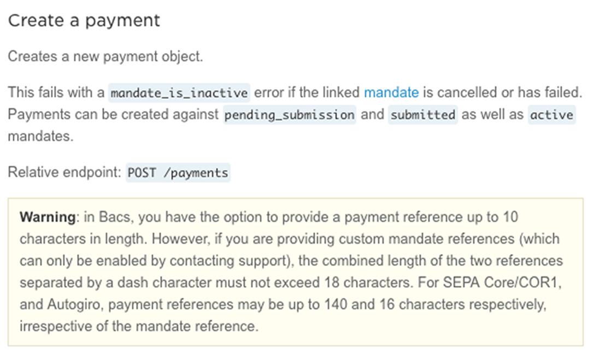

Note:
- gocardless
- Does that mean we will get a 400 code with long refs?

---

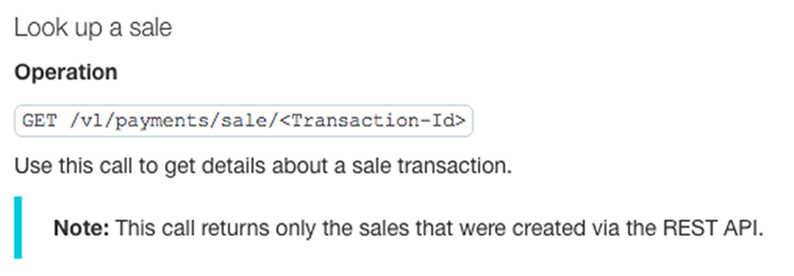

Note:
- paypal
- so i can't use the API to access non-API based payments?
- disparate databases perhaps?

---

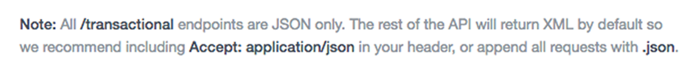

Note:
- campaignmonitor
- returns XML except when it doesn't

---

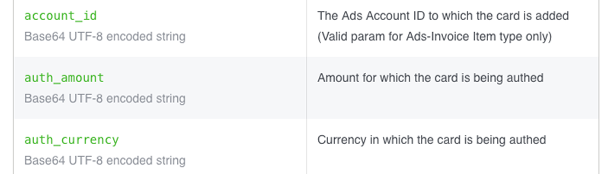

Note:
- facebook
- base64 encoded simple strings? (mistakes in the docs perhaps?)

---

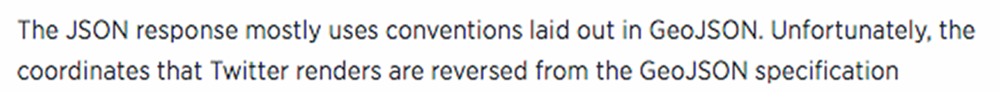

Note:
- twitter
- uses GeoJSON specification except co-ordinates are reversed?

---

"If the object returns application specific objects, messages and errors that should be acted on and these objects are valid a 200 response will be returned. Conversely, HTTP errors are considered exactly that... transport, non-application errors."

Note:
- (to follow) but...

---

"HTTP does not limit the nature of a resource; it merely defines an interface that might be used to interact with resources." - RFC 7231

---


### REST APIs

---

# REST

### Reinvented Every Single Time

---

## Every API is special.

---

## Every API is a beautiful and unique snowflake.

---

## But that doesn't bother me

(I'm not into bikeshedding)

---

## Write An Emulator

<p class="fragment"> It doesn't have to be stateful. Just mock response data. </p>

<p class="fragment"> Test against it. It's like TDD++. </p>

<p class="fragment"> You can write end to end tests without having to monkey patch. </p>

<p class="fragment"> Improve your CI coverage without relying on a third party server. </a>

---

<pre>
	/Users/leejohnson/working/business-mondo > wc -l mondo_emulator.pl
	     344 mondo_emulator.pl
</pre>

A preview:

```perl
use Mojolicious::Lite; # strict, warnings, utf8, perl5.10
use Mojo::JSON;

plugin 'OAuth2::Server' => { ...  };

post '/ping/whoami' => sub {
	my ( $c ) = @_;

	return $c->render( status => 401, text => 'Unauthorized' );
		if ! $c->oauth;

	$c->render( json => {
		authenticated => Mojo::JSON::true,
		client_id     => $c->oauth->{client},
		user_id       => $c->oauth->{user_id},
	} );

};

app->start;
```

---

<pre>
	/Users/leejohnson/working/business-mondo > cat end_to_end_emulated.sh
	#!/bin/bash

	# start emulator
	morbo mondo_emulator.pl -l 'https://*:3000' &
	sleep 2;

	# get an access token
	ACCESS_TOKEN=$(http --verify no --form POST "https://127.0.0.1:3000/oauth2/token" \
		"grant_type=password" \
		"client_id=test_client" \
		"client_secret=test_client_secret" \
		"username=leejo" \
		"password=Weeeee" \
		| jq -r '.access_token' \
	)

	# run end_to_end tests
	MONDO_DEBUG=1 \
		MONDO_ENDTOEND=1 \
		MONDO_TOKEN=$ACCESS_TOKEN \
		MONDO_URL='https://127.0.0.1:3000' \
		SKIP_CERT_CHECK=1 \
		prove -v -Ilib t/002_end_to_end.t

	# stop emulator
	pkill -f 'morbo mondo_emulator';
</pre>

Note:
- how it's run

---

<pre>
	/Users/leejohnson/working/business-mondo > cover
	Reading database from /Volumes/code_partition/business-mondo/cover_db
	
	------------------------------------------ ------ ------ ------ ------ ------
	File                                         stmt   bran   cond    sub  total
	------------------------------------------ ------ ------ ------ ------ ------
	blib/lib/Business/Mondo.pm                  100.0   50.0    n/a  100.0   93.3
	blib/lib/Business/Mondo/Account.pm           95.4   50.0   42.8   84.6   85.2
	blib/lib/Business/Mondo/Address.pm           85.7    n/a    n/a   66.6   80.0
	blib/lib/Business/Mondo/Attachment.pm        96.4   50.0   33.3  100.0   75.0
	blib/lib/Business/Mondo/Balance.pm          100.0    n/a    n/a  100.0  100.0
	blib/lib/Business/Mondo/Client.pm            96.2   65.3   50.0  100.0   89.7
	blib/lib/Business/Mondo/Currency.pm         100.0    n/a    n/a  100.0  100.0
	blib/lib/Business/Mondo/Exception.pm         85.7    n/a    n/a   66.6   80.0
	blib/lib/Business/Mondo/Merchant.pm          92.3    n/a    n/a   80.0   88.8
	blib/lib/Business/Mondo/Resource.pm          54.0   10.0    n/a   66.6   48.2
	blib/lib/Business/Mondo/Transaction.pm      100.0    n/a    n/a  100.0  100.0
	blib/lib/Business/Mondo/Utils.pm             72.7   50.0   66.6   75.0   67.5
	blib/lib/Business/Mondo/Version.pm          100.0    n/a    n/a  100.0  100.0
	blib/lib/Business/Mondo/Webhook.pm           91.6    n/a    n/a   80.0   88.2
	Total                                        89.9   50.0   40.7   88.7   82.5
	------------------------------------------ ------ ------ ------ ------ ------
</pre>

Note:
- just from that one end to end test
- that doesn't include the coverage from the unit testing

---

<pre>
	/Users/leejohnson/working/business-mondo > make test >/dev/null && cover
	Reading database from /Volumes/code_partition/business-mondo/cover_db

	------------------------------------------ ------ ------ ------ ------ ------
	File                                         stmt   bran   cond    sub  total
	------------------------------------------ ------ ------ ------ ------ ------
	blib/lib/Business/Mondo.pm                  100.0   66.6    n/a  100.0   95.5
	blib/lib/Business/Mondo/Account.pm          100.0  100.0   57.1  100.0   95.5
	blib/lib/Business/Mondo/Address.pm          100.0    n/a    n/a  100.0  100.0
	blib/lib/Business/Mondo/Attachment.pm        96.4   66.6   60.0  100.0   83.9
	blib/lib/Business/Mondo/Balance.pm          100.0    n/a    n/a  100.0  100.0
	blib/lib/Business/Mondo/Client.pm            96.2   73.0   50.0  100.0   91.3
	blib/lib/Business/Mondo/Currency.pm         100.0    n/a    n/a  100.0  100.0
	blib/lib/Business/Mondo/Exception.pm        100.0    n/a    n/a  100.0  100.0
	blib/lib/Business/Mondo/Merchant.pm         100.0    n/a    n/a  100.0  100.0
	blib/lib/Business/Mondo/Resource.pm         100.0   90.0    n/a  100.0   98.2
	blib/lib/Business/Mondo/Transaction.pm      100.0    n/a    n/a  100.0  100.0
	blib/lib/Business/Mondo/Utils.pm            100.0  100.0   66.6  100.0   97.3
	blib/lib/Business/Mondo/Version.pm          100.0    n/a    n/a  100.0  100.0
	blib/lib/Business/Mondo/Webhook.pm          100.0    n/a    n/a  100.0  100.0
	Total                                        98.8   80.0   59.2  100.0   94.8
	------------------------------------------ ------ ------ ------ ------ ------
</pre>

---

## Here's That Suggestion

<p class="fragment"> If you build a RESTful API don't just release API docs but also allow access to an emulator. </p>

<p class="fragment"> I don't mean a test server, I mean an actual simple executable that can be used locally. </p>

<p class="fragment"> Dogfood it, to see where your API might need work. </p>

<p class="fragment"> Update it when you update your API docs .</p>

Note:
- if that seems like too much work then keep in mind that:
- any competent developer is probably going to write one anyway, so you're saving them work
- it will highlight gaps in your API/docs/implementation
- it will probably save you a tonne of time supporting queries about the API and/or test server

---

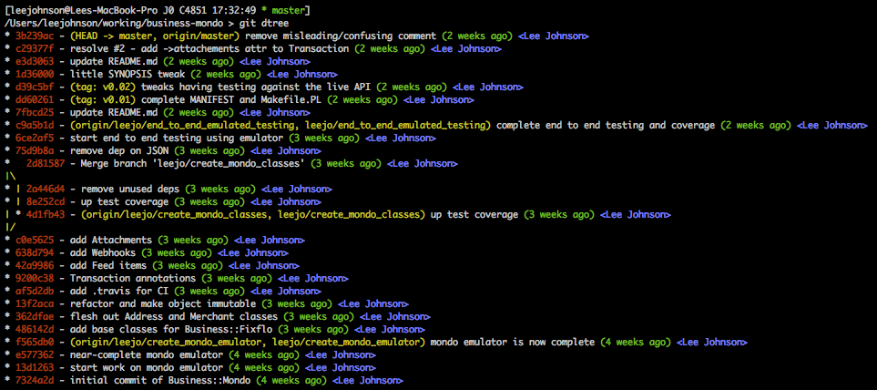

Note:
- commits against Business::Mondo
- leejo/create_mondo_emulator - created emulator
- leejo/create_mondo_classes - created classes, tests against emulator
- leejo/end_to_end_emulated_testing - end to end testing against emulator
- v0.01 - released to CPAN
- v0.02 - received my Mondo card, tested (end to end) against live API

---

<pre>
	commit d39c5bf5926df3ff7da2842b26e485a791311964
	Author: Lee Johnson <lee@givengain.ch>
	Date:   Thu Apr 28 21:53:26 2016 +0200

		tweaks having testing against the live API

		added t/004_end_to_end_LIVE.t for testing this. the only real diff
		here is that the merchant can be null so we need to handle that in
		the coercion

		tweak the pod slightly, bump VERSION and Changes for CPAN release

	 lib/Business/Mondo.pm             | 37 ++++++++++++++++++++-----------------
	 lib/Business/Mondo/Balance.pm     | 18 +-----------------
	 lib/Business/Mondo/Client.pm      |  3 +--
	 lib/Business/Mondo/Currency.pm    | 47 +++++++++++++++++++++++++++++++++++++++++++++++
	 lib/Business/Mondo/Transaction.pm | 21 ++++-----------------
	 lib/Business/Mondo/Version.pm     |  2 +-
	 6 files changed, 74 insertions(+), 54 deletions(-)
</pre>

[Full history here](https://github.com/leejo/business-mondo/commits/master)

Note:
- and most of that was refactoring out some code into a role
- full history available, i have kept the dev branches
- yeah it's not perfect, will have bugs, is a work in progress (as per the Mondo API)
- but it was a piece of cake to write because of the emulator
- 99% of the work was done before it connected to a live or even test (non-local) server
- and it turned out (to go back to the start of the talk)...

---

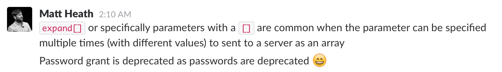

"Password grant is deprecated as passwords are deprecated"

Note:
- and it turns out Mondo deprecated the password grant
- well, at least it gave me an excuse to refactor some of the bad design decisions in Mojolicious::Plugin::OAuth2::Server.
